# 안녕하세요, 조영범입니다 👋

### Cho Youngbeom · `z3rotig4r`

**AI Red Teaming** 🔴 · **Agentic AI Harness Engineering** 🤖 · **AI Security** 🛡️

---

## 🧠 관심 분야

- 🔴 **AI Red Teaming** — LLM/에이전트 공격 표면 분석, 프롬프트 인젝션·탈옥 평가
- 🤖 **Agentic AI Harness Engineering** — 에이전트 중심 하네스 설계 및 자동화 체계 구축
- 🛡️ **AI Security** — 모델·파이프라인 보안, 위협 모델링

> 현재 Agentic AI 하네스 엔지니어링과 AI 레드티밍에 집중하고 있습니다.

🇺🇸 <b>View in English</b>

 

Hi, I'm **Cho Youngbeom** (`z3rotig4r`).

- 🔴 **AI Red Teaming** — attack-surface analysis for LLMs/agents, prompt-injection & jailbreak evaluation
- 🤖 **Agentic AI Harness Engineering** — agent-centric harness design & automation pipelines
- 🛡️ **AI Security** — model/pipeline security, threat modeling

> Currently focused on Agentic AI harness engineering and AI red teaming.

## 📫 연락처

- **E-mail**: `colin0427@cau.ac.kr` · `zerotiger4764@gmail.com`

---

## ✍️ 최신 블로그 글

<!-- BLOG-POST-LIST:START -->
- [[News & Trends] AI 보안 위클리 (2026-06-09) — 에이전틱 레드티밍·LLM 에이전트 취약점](https://z3rotig4r.github.io/posts/news-weekly-2026-06-09/)
- [[AI Red Teaming] 프롬프트 인젝션 완전정복 — 직접·간접 주입과 탈옥(Jailbreak)](https://z3rotig4r.github.io/posts/prompt-injection-deep-dive/)
- [[AI Red Teaming] AI 레드티밍이란? — 정의, 전통 보안과의 차이, 방법론](https://z3rotig4r.github.io/posts/what-is-ai-red-teaming/)
- [[정보보안기사 실기] 침해사고 분석 및 대응: 주요 취약점](https://z3rotig4r.github.io/posts/%EC%A0%95%EB%B3%B4%EB%B3%B4%EC%95%88%EA%B8%B0%EC%82%AC-%EC%8B%A4%EA%B8%B0-%EC%B9%A8%ED%95%B4%EC%82%AC%EA%B3%A0-%EB%B6%84%EC%84%9D-%EB%B0%8F-%EB%8C%80%EC%9D%91-%EC%A3%BC%EC%9A%94-%EC%B7%A8%EC%95%BD%EC%A0%90/)
- [[정보보안기사 실기] 침해사고 분석 및 대응: 시스템 점검 도구](https://z3rotig4r.github.io/posts/%EC%A0%95%EB%B3%B4%EB%B3%B4%EC%95%88%EA%B8%B0%EC%82%AC-%EC%8B%A4%EA%B8%B0-%EC%B9%A8%ED%95%B4%EC%82%AC%EA%B3%A0-%EB%B6%84%EC%84%9D-%EB%B0%8F-%EB%8C%80%EC%9D%91-%EC%8B%9C%EC%8A%A4%ED%85%9C-%EC%A0%90%EA%B2%80-%EB%8F%84%EA%B5%AC/)
<!-- BLOG-POST-LIST:END -->

➡️ [더 보기](https://z3rotig4r.github.io)

---

## 🛠️ Tech Stack

---

## 🌱 오픈소스 기여

---

### 📊 GitHub Stats

